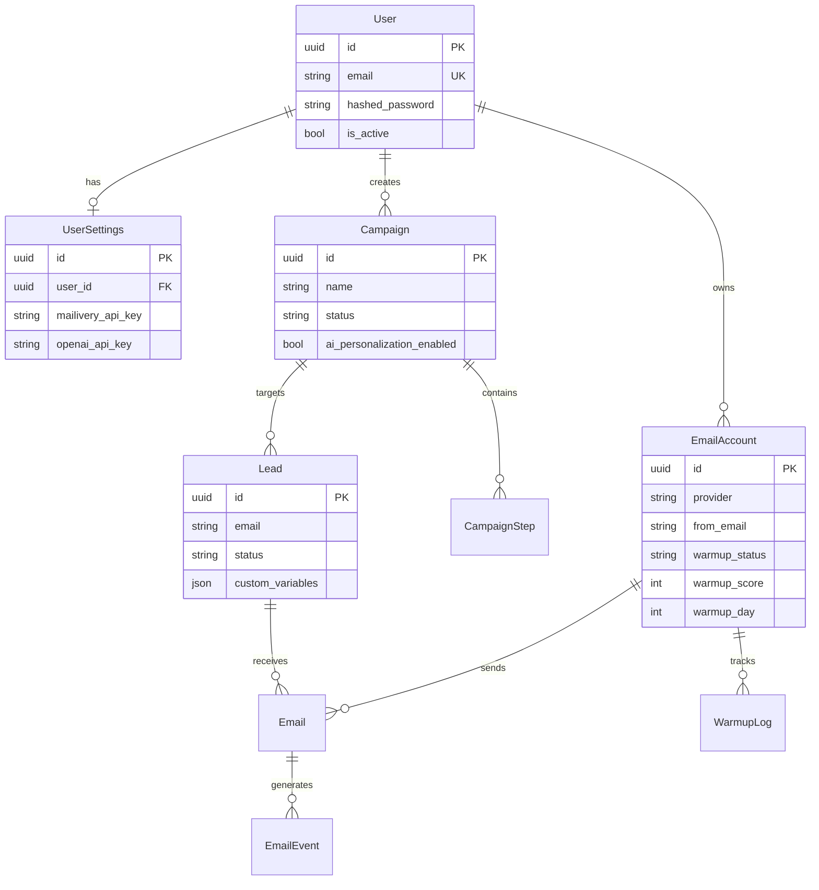

<div align="center">

# ⚡ Instantly.ai Clone

**Платформа для автоматизации cold email outreach с AI-персонализацией**

[](https://python.org)
[](https://fastapi.tiangolo.com)
[](https://react.dev)
[](https://postgresql.org)
[](https://docs.docker.com/compose/)
[](LICENSE)

[Демо](#-быстрый-старт) · [Архитектура](#-архитектура) · [API](#-api-endpoints) · [Warmup](#-email-warmup) · [Деплой](#-деплой)

</div>

---

## 📋 Что это

Full-stack клон [Instantly.ai](https://instantly.ai) — платформы для автоматизации холодных email-рассылок. Построен на FastAPI + React, запускается одной командой через Docker Compose.

### Ключевые возможности

- **Кампании** — мульти-шаговые email-последовательности с настраиваемыми задержками
- **AI-персонализация** — GPT-4 адаптирует каждое письмо под получателя
- **Email Accounts** — поддержка SMTP и [Resend](https://resend.com) API, ротация аккаунтов
- **Warmup** — прогрев email-аккаунтов через [Mailivery](https://mailivery.io) API или собственный пул
- **Лиды** — одиночный и массовый CSV-импорт с дедупликацией
- **Трекинг** — отслеживание открытий (pixel), кликов (redirect), ответов (webhook)
- **Аналитика** — open/click/reply rate, conversion funnel, per-lead timeline
- **Settings UI** — API ключи (Mailivery, OpenAI) настраиваются через интерфейс, не через .env

---

## 🏗 Архитектура

```
┌──────────────────────────────────────────────────────────────┐
│                        Frontend                              │
│              React 18 · Vite · Tailwind CSS                  │
│                    localhost:5173                             │
└──────────────┬───────────────────────────────────────────────┘
               │  /api/* (Vite proxy)
┌──────────────▼───────────────────────────────────────────────┐
│                        Backend                               │
│            FastAPI · SQLAlchemy 2.0 (async)                   │
│                    localhost:8002                             │
│                                                              │
│  ┌──────────┐ ┌──────────┐ ┌──────────┐ ┌────────────────┐  │
│  │   Auth   │ │Campaigns │ │  Leads   │ │   Analytics    │  │
│  │  (JWT)   │ │ + Steps  │ │ + Bulk   │ │  + Timeline    │  │
│  └──────────┘ └──────────┘ └──────────┘ └────────────────┘  │
│  ┌──────────┐ ┌──────────┐ ┌──────────┐ ┌────────────────┐  │
│  │ Accounts │ │  Emails  │ │  Warmup  │ │ AI Personal.   │  │
│  │SMTP/Resnd│ │ +Tracking│ │Mailivery │ │   GPT-4        │  │
│  └──────────┘ └──────────┘ └──────────┘ └────────────────┘  │
│  ┌─────────────────────────────────────────────────────────┐ │
│  │  Settings (per-user API keys: Mailivery, OpenAI)        │ │
│  └─────────────────────────────────────────────────────────┘ │
└──────────────┬───────────────────────────────────────────────┘
               │
┌──────────────▼───────────────────────────────────────────────┐
│                     PostgreSQL 15                             │
│  Users · UserSettings · EmailAccounts · Campaigns · Steps    │
│  Leads · Emails · EmailEvents · WarmupLogs                   │
└──────────────────────────────────────────────────────────────┘
```

### Tech Stack

| Слой | Технологии |
|------|-----------|
| **Frontend** | React 18, Vite 5, Tailwind CSS 3, Zustand, Recharts, React Router 6 |
| **Backend** | FastAPI, SQLAlchemy 2.0 (async), Pydantic v2, python-jose (JWT) |
| **Database** | PostgreSQL 15 (asyncpg driver) |
| **Email** | aiosmtplib (SMTP), Resend SDK, Mailivery API |
| **AI** | OpenAI SDK (GPT-4) с fallback на шаблоны |
| **Infra** | Docker Compose, multi-stage Dockerfile |

---

## 🚀 Быстрый старт

### Предварительные требования

- [Docker](https://docs.docker.com/get-docker/) + Docker Compose
- (Опционально) [Resend API key](https://resend.com/api-keys) для отправки email

### Запуск

```bash
# 1. Клонировать
git clone https://github.com/djd1m/2026-PU-APR-LESSON-05-instantly-00.git
cd 2026-PU-APR-LESSON-05-instantly-00

# 2. Настроить окружение (опционально)
cp .env.example .env
# Отредактировать .env — задать SECRET_KEY, OPENAI_API_KEY и т.д.

# 3. Запустить
docker compose up -d --build

# 4. Готово!
# Frontend:  http://localhost:5173
# Backend:   http://localhost:8002/docs
```

### Первые шаги

1. Открыть http://localhost:5173
2. Зарегистрировать аккаунт (Register)
3. **Настроить API ключи** (Settings → ввести Mailivery и/или OpenAI ключи)
4. Добавить email account (Accounts → Add Account → выбрать Resend или SMTP)
5. Создать кампанию (Campaigns → New Campaign)
6. Добавить лиды (внутри кампании → вкладка Leads → Add Lead)
7. Активировать и отправить (Activate → Send Emails)

> API ключи можно настроить через UI (Settings) — редактирование `.env` не требуется.

---

## 📡 API Endpoints

### Аутентификация

| Метод | Путь | Описание |
|-------|------|----------|
| `POST` | `/auth/register` | Регистрация `{email, password}` |
| `POST` | `/auth/login` | Логин (OAuth2 form) → JWT token |
| `GET` | `/auth/me` | Текущий пользователь |

### Кампании

| Метод | Путь | Описание |
|-------|------|----------|
| `GET` | `/campaigns/` | Список кампаний |
| `POST` | `/campaigns/` | Создать кампанию |
| `GET` | `/campaigns/{id}` | Детали кампании |
| `PUT` | `/campaigns/{id}` | Обновить кампанию |
| `PATCH` | `/campaigns/{id}/status` | Сменить статус (draft→active→paused→completed) |
| `DELETE` | `/campaigns/{id}` | Удалить кампанию |
| `GET` | `/campaigns/{id}/steps` | Шаги последовательности |
| `POST` | `/campaigns/{id}/steps` | Добавить шаг |
| `DELETE` | `/campaigns/{id}/steps/{step_id}` | Удалить шаг |

### Лиды

| Метод | Путь | Описание |
|-------|------|----------|
| `GET` | `/leads/` | Список (фильтр по campaign_id, status) |
| `POST` | `/leads/` | Добавить лид |
| `POST` | `/leads/bulk` | Массовый импорт с дедупликацией |
| `PUT` | `/leads/{id}` | Обновить лид |
| `DELETE` | `/leads/{id}` | Удалить лид |
| `GET` | `/leads/unsubscribe/{id}` | Публичная отписка (без auth) |

### Email Accounts

| Метод | Путь | Описание |
|-------|------|----------|
| `GET` | `/accounts/` | Список аккаунтов |
| `POST` | `/accounts/` | Добавить (SMTP или Resend) |
| `PUT` | `/accounts/{id}` | Обновить |
| `DELETE` | `/accounts/{id}` | Удалить |
| `POST` | `/accounts/{id}/warmup/start` | Начать warmup |
| `POST` | `/accounts/{id}/warmup/pause` | Пауза warmup |
| `POST` | `/accounts/{id}/warmup/advance` | Продвинуть день (демо) |
| `GET` | `/accounts/{id}/warmup/status` | Статус warmup + история |

### Email & Tracking

| Метод | Путь | Описание |
|-------|------|----------|
| `POST` | `/emails/send/{campaign_id}` | Запустить отправку (async, 202) |
| `GET` | `/emails` | Список отправленных |
| `GET` | `/track/open/{email_id}` | Tracking pixel (1x1 GIF) |
| `GET` | `/track/click/{email_id}?url=` | Click tracking (302 redirect) |
| `POST` | `/track/reply/{email_id}` | Reply webhook |

### Аналитика

| Метод | Путь | Описание |
|-------|------|----------|
| `GET` | `/analytics/campaign/{id}` | Метрики кампании (open/click/reply rate) |
| `GET` | `/analytics/lead/{id}/timeline` | Timeline событий лида |
| `GET` | `/analytics/account/{id}` | Статистика email-аккаунта |

### Настройки

| Метод | Путь | Описание |
|-------|------|----------|
| `GET` | `/settings/` | Текущие настройки (ключи замаскированы) |
| `PUT` | `/settings/` | Обновить API ключи (Mailivery, OpenAI) |

> Интерактивная документация: **http://localhost:8002/docs** (Swagger UI)

---

## 🔥 Email Warmup

Три режима прогрева email-аккаунтов:

### 1. Mailivery API (production)

Ввести API ключ через **Settings** в UI (или через `.env`). Warmup автоматически использует peer-сеть Mailivery.

```
Settings → Mailivery API Key → Ввести ключ → Save
```

Стоимость: от $49/мес за shared volume pool (unlimited mailboxes).
Приоритет: UI Settings → `.env` → demo mode.

### 2. Self-hosted Pool (бюджетный)

Свои 10 seed-аккаунтов (Gmail/Outlook/Yandex) + cron-скрипт.

```bash
# Настроить пул
cp features/instantly-ai-frontend/warmup-self-hosted/warmup-pool.json.example warmup-pool.json
# Заполнить credentials

# Запустить вручную
python3 features/instantly-ai-frontend/warmup-self-hosted/warmup_pool_cron.py

# Или через cron (каждый час 9-18 МСК)
0 6-15 * * * cd /opt/warmup && python3 warmup_pool_cron.py >> /var/log/warmup.log 2>&1
```

Подробности: [`features/instantly-ai-frontend/warmup-self-hosted/`](features/instantly-ai-frontend/warmup-self-hosted/)

### 3. Demo Mode (по умолчанию)

Без API-ключа warmup работает в demo-режиме — локальный state machine для демонстрации UI. Кнопка "Advance Day" симулирует прогрев.

### Расписание рампа (14 дней)

```
День 1-2:   5 писем/день     ████░░░░░░░░░░░░░░░░
День 3-4:   8 писем/день     ██████░░░░░░░░░░░░░░
День 5-6:  12 писем/день     ████████░░░░░░░░░░░░
День 7-8:  18 писем/день     ████████████░░░░░░░░
День 9-10: 25 писем/день     ████████████████░░░░
День 11-12:33 писем/день     ██████████████████░░
День 13:   42 писем/день     ███████████████████░
День 14+:  50 писем/день     ████████████████████
```

---

## 📁 Структура проекта

```
├── main.py                         # FastAPI entry point
├── config.py                       # Pydantic Settings (env vars)
├── docker-compose.yml              # Backend + Frontend + PostgreSQL
├── Dockerfile                      # Backend (Python 3.12, multi-stage)
├── requirements.txt                # Python dependencies
│
├── models/
│   ├── __init__.py                 # Model exports
│   └── database.py                 # SQLAlchemy models (9 таблиц)
│
├── routers/
│   ├── auth.py                     # JWT auth (register, login, me)
│   ├── accounts.py                 # Email accounts CRUD + warmup endpoints
│   ├── campaigns.py                # Campaigns CRUD + steps + status transitions
│   ├── leads.py                    # Leads CRUD + bulk import + unsubscribe
│   ├── emails.py                   # Send + tracking (pixel, click, reply)
│   ├── analytics.py                # Campaign stats + lead timeline
│   └── settings.py                 # Per-user settings (API keys via UI)
│
├── services/
│   ├── email_sender.py             # SMTP sending with account rotation + retry
│   ├── resend_sender.py            # Resend API sender
│   ├── ai_personalization.py       # GPT-4 email personalization
│   ├── warmup.py                   # Warmup state machine (Mailivery / demo)
│   └── mailivery_client.py         # Mailivery REST API client
│
├── frontend/
│   ├── Dockerfile                  # Node 20, Vite dev server
│   ├── package.json                # React, Zustand, Recharts, Tailwind
│   ├── vite.config.js              # API proxy (/api → backend)
│   └── src/
│       ├── api/client.js           # Fetch wrapper (JWT, error handling)
│       ├── store/auth.js           # Zustand auth store
│       ├── components/             # Layout, Sidebar, Modal, StatusBadge, MetricCard
│       └── pages/                  # Dashboard, Campaigns, Leads, Accounts, Analytics, Settings
│
├── features/
│   └── instantly-ai-frontend/
│       ├── warmup-api-research.md  # Сравнение warmup-провайдеров
│       └── warmup-self-hosted/     # Self-hosted warmup pool (скрипты + инструкции)
│
└── tests/                          # pytest + pytest-asyncio
```

---

## ⚙️ Конфигурация

### Через UI (рекомендуется)

API ключи настраиваются на странице **Settings** в веб-интерфейсе. Ключи хранятся per-user в базе данных и никогда не показываются полностью после сохранения.

| Ключ | Назначение | Где получить |
|------|-----------|-------------|
| **Mailivery API Key** | Email warmup через peer-сеть | [mailivery.io](https://mailivery.io) |
| **OpenAI API Key** | AI-персонализация email (GPT-4) | [platform.openai.com](https://platform.openai.com/api-keys) |

Приоритет: **UI Settings** → переменные окружения → demo mode.

### Через переменные окружения (fallback)

| Переменная | По умолчанию | Описание |
|-----------|-------------|----------|
| `DATABASE_URL` | `postgresql+asyncpg://...` | Строка подключения к PostgreSQL |
| `SECRET_KEY` | `change-me...` | Ключ подписи JWT (обязательно сменить!) |
| `OPENAI_API_KEY` | — | Fallback для AI-персонализации |
| `MAILIVERY_API_KEY` | — | Fallback для warmup |
| `DEBUG` | `false` | Режим отладки (SQL echo, hot reload) |
| `CORS_ORIGINS` | `["http://localhost:5173"]` | Разрешённые origins |

Полный список: [`.env.example`](.env.example)

---

## 🐳 Деплой

### Docker Compose (рекомендуется)

```bash
docker compose up -d --build
```

Сервисы:

| Сервис | Порт | Описание |
|--------|------|----------|
| `frontend` | 5173 | React + Vite dev server |
| `app` | 8002 | FastAPI backend |
| `db` | 5438 | PostgreSQL 15 |

### Production

Для production-деплоя рекомендуется:

1. Сменить `SECRET_KEY` на случайную строку (`openssl rand -hex 32`)
2. Задать `DEBUG=false`
3. Настроить `CORS_ORIGINS` с реальным доменом
4. Использовать nginx/Caddy как reverse proxy с HTTPS
5. Собрать фронтенд (`npm run build`) и раздавать через nginx

---

## 🧪 Тесты

```bash
# Запуск тестов
docker compose exec app pytest -v

# Или локально
pip install -r requirements.txt
pytest -v
```

---

## 📊 Data Model



---

## 📄 Лицензия

MIT

---

<div align="center">

**Создано с помощью [Claude Code](https://claude.ai/code)**

</div>
